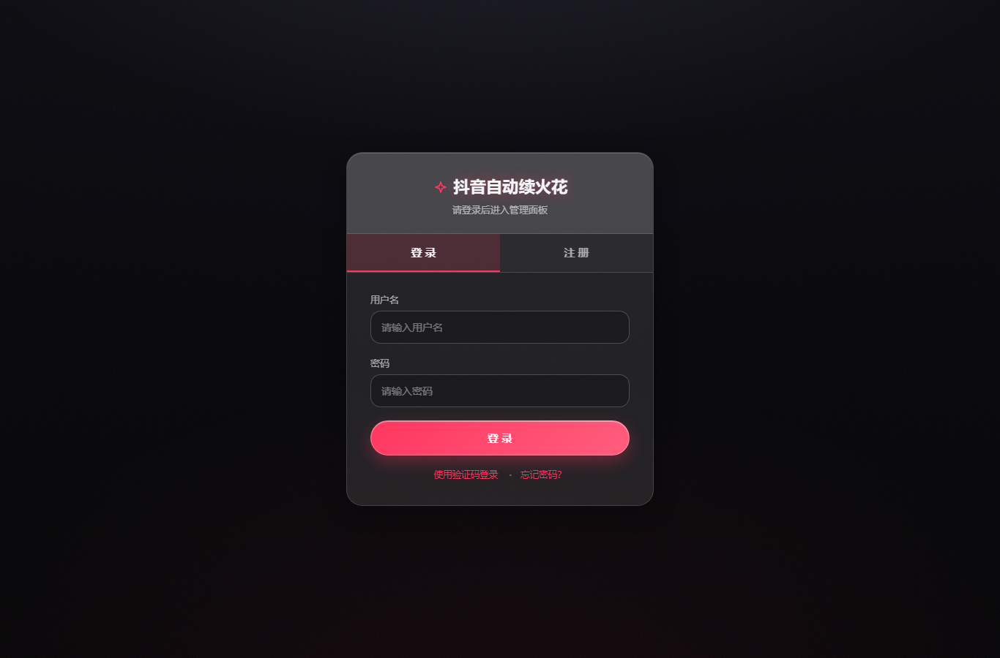
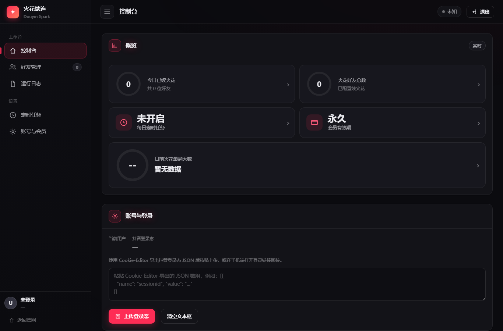
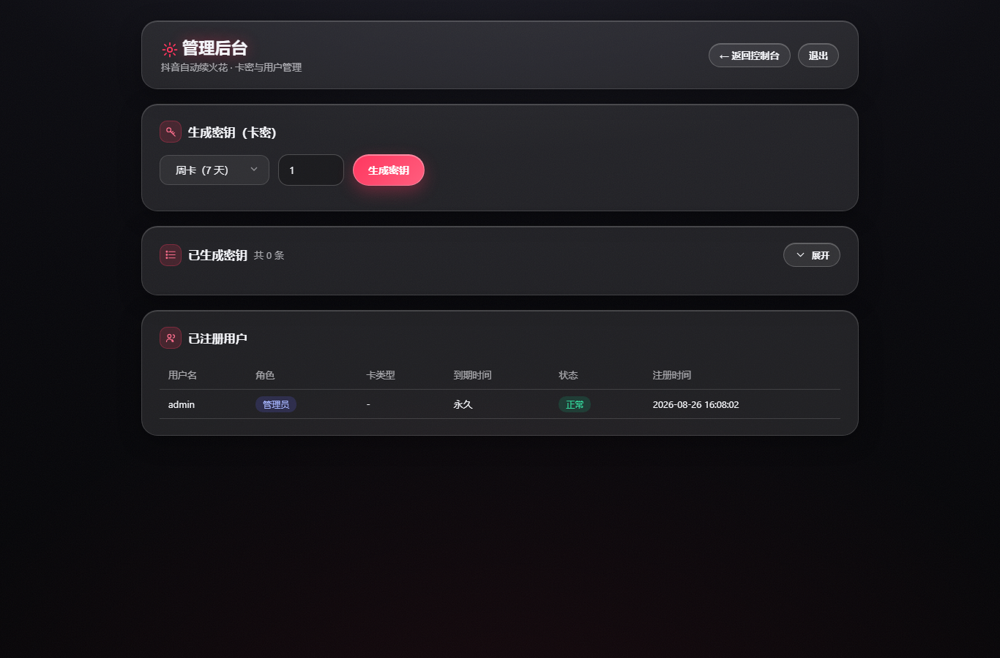
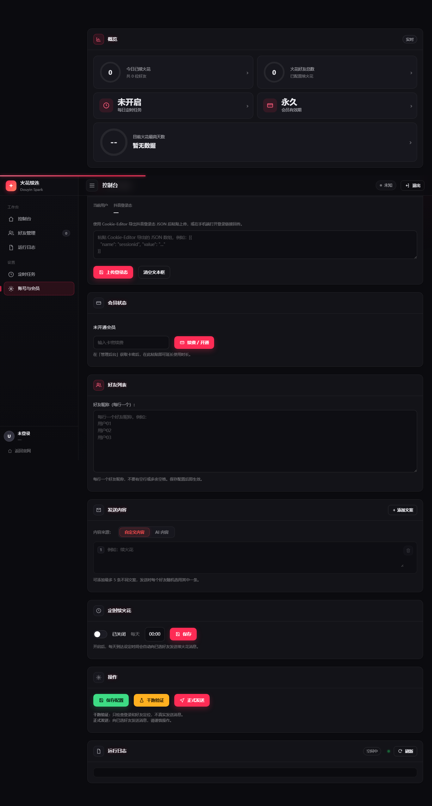

# 抖音续火花管理面板 · Douyin Fire

[](https://www.npmjs.com/package/douyin-fire)
[](LICENSE)

**Douyin Fire** 是一个用于**自动给抖音好友「续火花」**的可视化面板：内置 Web 控制台，配合 Playwright 驱动浏览器，按计划给你的抖音好友发送消息 / 表情 / 图片，保持每日互动、避免火花熄灭。

- 官网：https://dongdongclub.shop
- npm：`npm i -g douyin-fire`
- 仓库：`server/`（服务器部署版）、`local/`（本地部署版）、`npm/`（npm 版，即本地部署版）

---

## 一、项目简介

很多人的抖音「友情火花」需要每天互发消息才能维系。Douyin Fire 把这件事自动化：

1. 你在面板里配置**要维护火花的好友**和**要发送的内容**（文本 / 图片 / 抖音原生表情 / AI 生成文案）；
2. 面板用你自己的抖音登录态（扫码或粘贴 Cookie），通过内置浏览器**模拟真人操作**打开好友聊天框并发送；
3. 支持**随机间隔、防重复、图文混排、AI 文案、定时任务、实时日志、运行统计**等，尽量贴近人工、降低风控。

技术栈：Python 3 + Playwright（浏览器自动化）+ 内置 `http.server` 面板（无需额外 Web 框架）+ 纯前端 `webui/`（HTML/CSS/JS）。

> 本项目提供 **三种等价部署方式**：服务器部署版（`server/`）、本地一键版（`local/`）、npm 版（`npm/`）。三者代码完全一致，区别只在部署形态与配置。

---

## 二、功能特性（全部功能及作用）

### 账号与登录
| # | 功能 | 作用 |
|---|---|---|
| 1 | **抖音扫码登录** | 后台打开内置浏览器，手机抖音扫码即可登录，登录态保存在本地，无需手动处理 Cookie。 |
| 2 | **Cookie 粘贴登录** | 不会扫码时，可用配套「抖音 Cookie 获取工具」导出 Cookie，在【个人中心】一键粘贴上传。 |
| 3 | **多账号管理** | 支持配置多个抖音账号，分别维护各自的火花任务（`account_runner` / `accounts`）。 |
| 4 | **登录态管理（个人中心）** | 查看当前登录态有效期、随时重新登录 / 退出 / 清除 Cookie，Cookie 失效时自动提示。 |

### 消息发送（核心）
| # | 功能 | 作用 |
|---|---|---|
| 5 | **续火花消息发送** | 核心能力：自动打开指定好友的聊天框并发送消息，保持每日互动。 |
| 6 | **文本 / 图片 / 原生表情 / 随机消息** | 消息支持 4 种类型：纯文本、本地图片（PNG/JPG/GIF/WEBP）、抖音**原生表情**（按名称发送，失败自动回退）、以及「随机池」从多条里随机抽一条，提升拟真度。 |
| 7 | **发送间隔随机化** | 每次发送间隔在 `min~max` 秒之间随机，避免固定频率被风控识别。 |
| 8 | **防重复发送** | 开启后同一内容不会在短时间内重复发给同一好友。 |
| 9 | **好友同步** | 一键从抖音拉取好友列表，直接勾选要维护火花的对象，免去手动录入。 |

### AI 文案
| # | 功能 | 作用 |
|---|---|---|
| 10 | **AI 智能文案** | 选择 `ai` 内容模式后，由大模型按设定风格实时生成文案；内置 **智谱 GLM-4-Flash** 与 **OpenRouter**（如 Llama-3.3-70B）等接口，也可自定义 base_url / 模型。 |

### 任务与调度
| # | 功能 | 作用 |
|---|---|---|
| 11 | **任务调度** | 通过 `schedule.json` 配置执行计划（定时 / 周期），到点自动运行，无需人工点击。 |
| 12 | **实时日志** | 通过 `EventSource` 实时滚动展示运行过程（打开好友、发送、成功 / 失败、重试），便于排查。 |
| 13 | **运行统计** | 展示发送成功 / 失败数、运行时长等指标，掌握任务健康状况。 |

### 管理后台
| # | 功能 | 作用 |
|---|---|---|
| 14 | **用户管理** | 管理员可查看 / 管理注册用户、角色与有效期（`webui_auth`）。 |
| 15 | **会员 / 激活码** | 支持生成激活码、兑换会员、延长有效期，便于分发与授权（`activations.json`）。 |
| 16 | **邮箱验证码** | 注册 / 找回密码时通过邮件发送验证码（接入 Resend，需配置 `RESEND_API_KEY`）。 |
| 17 | **钉钉通知** | 配置钉钉机器人 Webhook + 加签 Secret 后，任务结果可推送到钉钉群，远程也能感知。 |

### 部署与运维
| # | 功能 | 作用 |
|---|---|---|
| 18 | **三种部署方式** | 服务器版（生产 / 公网域名 + HTTPS）、本地版（Windows 一键）、npm 版（命令行启动），按需选择。 |
| 19 | **免登录本地模式（DEPLOY_MODE=local）** | 本地 / 独立部署设 `DEPLOY_MODE=local` 可跳过登录、默认永久会员，开箱即用。 |
| 20 | **反向代理 / HTTPS** | 服务器版提供 Nginx 示例与 systemd 单元，配合域名 + 证书对外安全暴露。 |

---

## 三、截图

> 以下为官网与本地控制台实拍（本地版以 `DEPLOY_MODE=local` 运行）。

| 说明 | 图片 |
|---|---|
| 官网登录页（公开） |  |
| 控制台（Dashboard） |  |
| 管理后台 |  |
| 个人中心（登录态 / Cookie） |  |

---

## 四、部署方式

### 方式一：服务器部署版（`server/`）
适用于 VPS / 公网服务器，配合 Nginx 反向代理 + 域名 + HTTPS，常驻运行、开放给他人访问。
详细步骤见 [`server/README.md`](server/README.md)：上传代码 → `bash setup.sh` → 配置 `nginx.conf.example` →（可选）`douyin-fire.service` 守护。

### 方式二：本地部署版（`local/`）
适用于**自己的 Windows 电脑**一键运行，无需服务器。
详细步骤见 [`local/README.md`](local/README.md)：装好 Python → 双击 `install.bat` → 浏览器自动打开 `http://127.0.0.1:8765/`，**免登录**直接使用。

### 方式三：npm
```bash
npm install -g douyin-fire
douyin-fire            # 启动，自动建 venv / 装依赖 / 下 Chromium，打开 http://127.0.0.1:8765/
douyin-fire stop       # 停止
```
npm 版即本地部署版的命令行形态，详见 [`npm/README.md`](npm/README.md)。

---

## 五、详细使用说明（本地版为例）

### 准备
1. 安装 **Python 3.11+** 并勾选「Add Python to PATH」：https://www.python.org/downloads/

### 一键部署
2. 把 `local/` 目录解压到任意位置（如 `D:\douyin-fire`）。
3. **双击 `install.bat`**：首次会自动 建虚拟环境 → 装依赖 → 下载 Chromium（约 150MB，耐心等几分钟）→ 启动服务 → 自动打开浏览器。

### 开始使用
4. 浏览器打开 `http://127.0.0.1:8765/`（脚本会自动打开）。
5. 本地版**免登录**，直接进入控制台。
6. 进入【个人中心】，用手机抖音**扫码登录**，或粘贴 Cookie（见下方「抖音 Cookie 获取工具」）。
7. 在【控制台】配置：
   - **好友**：点击「同步好友」勾选要维护火花的对象；
   - **消息**：填写文本 / 选择抖音原生表情 / 上传图片 / 配置随机池；或开启 **AI 文案** 并填写模型配置；
   - **间隔**：设置发送间隔 `min~max` 秒（建议 3~8），开启防重复。
8. 点击「开始」，面板自动逐个打开好友聊天框发送；可在「实时日志」观察进度。

### 日常
| 场景 | 操作 |
|---|---|
| 启动 | 双击 `start.bat` |
| 停止 | 双击 `stop.bat` |
| 退出免登录模式 | 编辑 `start.bat`，把 `set "DEPLOY_MODE=local"` 改为 `set "DEPLOY_MODE=server"` 即恢复账号登录 |

### 常见问题
- **下载 Chromium 慢 / 失败**：首次约 150MB，需能访问 `cdn.playwright.dev`；失败重跑 `install.bat`（已下部分会跳过），或配置代理。
- **浏览器打不开 / 无法访问**：确认黑色服务窗口（DouyinFire）没被关；访问的是 `http://127.0.0.1:8765/`（本地，不是 https）。
- **登录态失效 / 被风控**：登录态会过期，到【个人中心】重新登录；自动化有被风控可能，建议小号测试、控制频率。

---

## 六、🍪 抖音 Cookie 获取工具

配套的小工具，用于**在你的电脑上导出抖音 Cookie**，再粘贴到面板的【个人中心】完成登录（适合不方便扫码的场景）。

- 下载：`抖音Cookie获取工具-完整版(1).zip`（见本仓库 **Releases**）
- 体积：约 370MB（内置 Playwright 浏览器运行时，请勿单独抽取 exe）

### 使用步骤
1. 将压缩包**整体解压**（保持 `抖音Cookie获取工具.exe` 与 `ms-playwright` 文件夹在同一目录）。
2. 双击运行 `抖音Cookie获取工具.exe`。
3. 程序打开内置浏览器，登录抖音后点击「**提取 Cookie**」。
4. 导出的 Cookie 复制 / 保存，粘贴到面板的【个人中心】即可。

### 功能
| 功能 | 作用 |
|---|---|
| 内置浏览器登录抖音 | 在工具内直接登录，隔离你的日常浏览器环境。 |
| 一键提取 Cookie | 登录后一键抓取当前账号 Cookie，免去手动从开发者工具复制。 |
| Cookie 导出 | 支持复制或保存为文件，便于粘贴到面板。 |
| 内置 Playwright 运行时 | 自带浏览器，开箱即用（需 Windows 10/11 64 位）。 |

> 注意：抖音有风控，提取的 Cookie 可能被判定为异常环境；本工具仅供**个人学习测试**使用。

---

## 七、免责声明

本工具用于**个人自动化**需求。请遵守抖音平台规则及相关法律法规；因使用本工具产生的账号风控、封禁、隐私等风险由使用者**自行承担**。请勿用于刷量、骚扰、 commercial 滥用等违规场景。

## 八、License

[MIT](LICENSE) © dy-dongjinhuan
